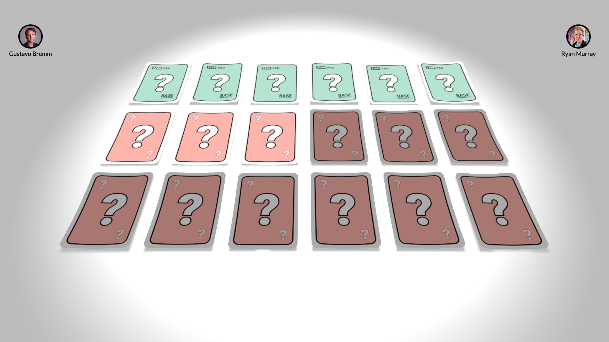

# sanity-meetup-card

This project was made in a few hours for the [Sanity developer deep dive](https://www.sanity.io/developer-deep-dive) meetup presentation.

Demo : https://sanity-meetup-cards.netlify.app/

Presentation : https://www.youtube.com/watch?v=KYXkk4HIvzE

Presented by

- Ryan Murray - [3200.pro](https://3200.pro)
- Gustavo Bremm - [Base Digital](https://base.digital/en)

To run the project on your own dataset create a .env file following the .env.example otherwise leave it as it is to run with our dataset.

Run with:
`yarn install && yarn dev`

Due the experimental nature of this project, interesting stuff can be found here:

- react-three-fiber
- observable-hooks
- dataloader
- tweenjs
- react-spring
- rand-seed
- html2canvas
